## Final Report

### Key Results

- **Momentum L-S:** +9.2% annualized return, Sharpe 0.23, max drawdown -65%
- **Transaction costs at 10 bps:** Reduce returns by 12% (gross 9.2% → net 8.1%)
- **Regime dependency:** Works in bulls (+26% in 1999-2007), fails in crises (-0.5% in 2008-2016)
- **Sector concentration:** All returns from Tech (+23%); Finance negative (-5%)
- **Earnings PEAD:** +5.4% for positive, -4.8% for negative (3-5 day drift)
- **Optimal parameters:** 12-1 momentum, monthly rebalancing (Sharpe 0.42)

---

## 1. Data & Methodology

### 1.1 Data

**Universe:** 10 large-cap US stocks
- **Tech:** AAPL, MSFT, GOOGL, AMZN, META, NVDA
- **Finance:** JPM, V
- **Healthcare:** UNH
- **Auto:** TSLA

**Time Period:** 1999-2025 (27 years)
- Full coverage: May 2013 - Dec 2025 (152 months)
- Earlier periods vary by stock

**Source:** Daily price data from Stooq, resampled to monthly

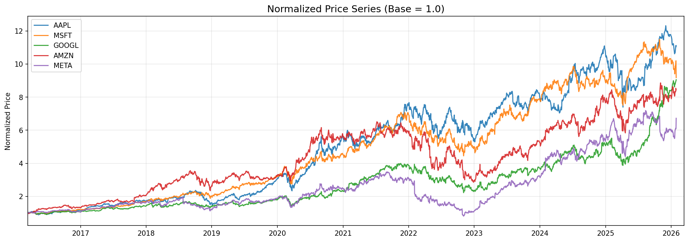
*Figure 1. Normalized price series (base = 1.0), last 10 years.*

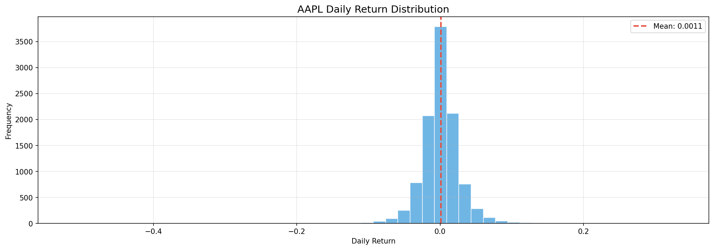
*Figure 2. AAPL daily return distribution — mean 0.11%, negative skew, fat tails.*

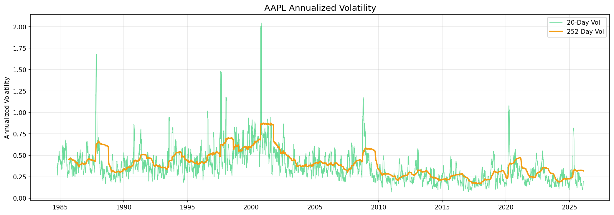
*Figure 3. AAPL annualized rolling volatility (20-day and 252-day).*

### 1.2 Factor Construction

**Momentum (12-1 Month):**
```
momentum_12_1 = (Price_t-1 / Price_t-12) - 1
```
Skip most recent month to avoid short-term reversal

**Contrarian (Price Reversal):**
```
value_score = -(Price_t / Price_t-12 - 1)
```

### 1.3 Portfolio Formation

Each month:
1. Rank stocks by factor (cross-sectional)
2. Form quintiles (Q1 = lowest 20%, Q5 = highest 20%)
3. Equal-weight within quintiles
4. Long-short: Q5 - Q1

**Forward returns:** `next_ret = Close.pct_change().shift(-1)` (avoid look-ahead bias)

---

## 2. Results Summary

### Data Quality & Cleaning

**Objective:** Validate 10 stocks, clean data, identify issues

**Key Findings:**
- Total data points: ~70,000
- Zero volume days: 9 stocks (1 day each) - market holiday, not error
- Outliers validated as real events:
  - UNH Jan 27, 2026: -19.6% (news event)
  - META Jan 29, 2026: +10.4% (earnings beat)
  - MSFT Jan 29, 2026: -10.0% (earnings miss)

**Data Cleaning:**
- Removed angle brackets from column names
- Dropped missing OHLC values
- Validated OHLC consistency (no errors)

---

### Factor Analysis (Momentum & Contrarian)

**Sample Period:** May 2013 - Dec 2025 (152 months full coverage)

**Momentum Quintile Results:**

| Quintile | Ann. Return | Ann. Vol | Sharpe | Cumulative |
|----------|-------------|----------|--------|------------|
| Q1 (Losers) | 15.3% | 38.2% | 0.40 | $1 → $87 |
| Q5 (Winners) | 32.1% | 41.7% | 0.77 | $1 → $203 |
| **L-S** | **9.2%** | **39.6%** | **0.23** | **$1 → $2.30** |

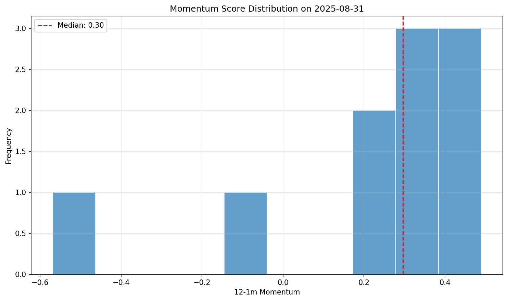
*Figure 4. Momentum score distribution — right-skewed, median 0.30, most stocks in positive territory.*

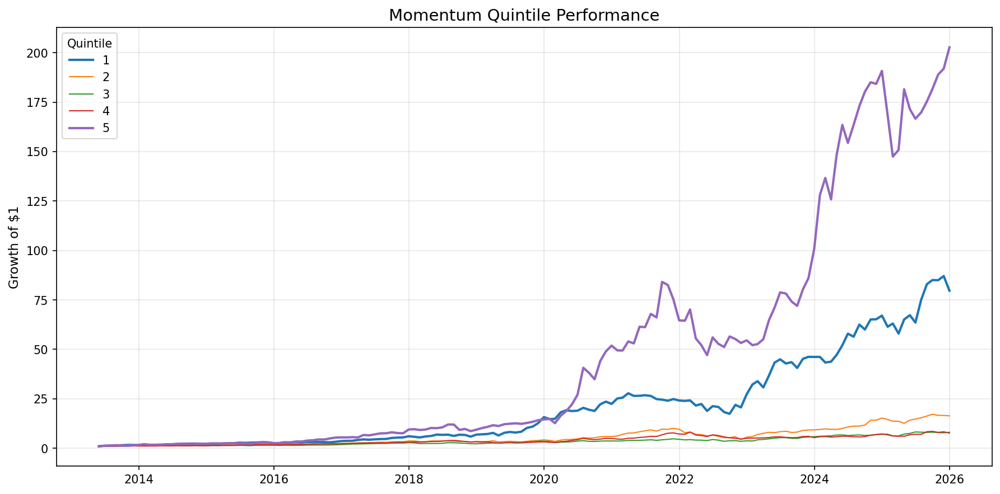
*Figure 5. Cumulative returns by quintile (2013–2026). Clear monotonic spread — Q5 reaches ~200×, Q1 ~87×.*

**Contrarian Results:**
- L-S return: -14.5%, Sharpe -0.36, max DD -95%
- Failed because recent losers kept losing (tech momentum dominated)

**Correlation:** Momentum vs Contrarian = -0.89 (strong negative)

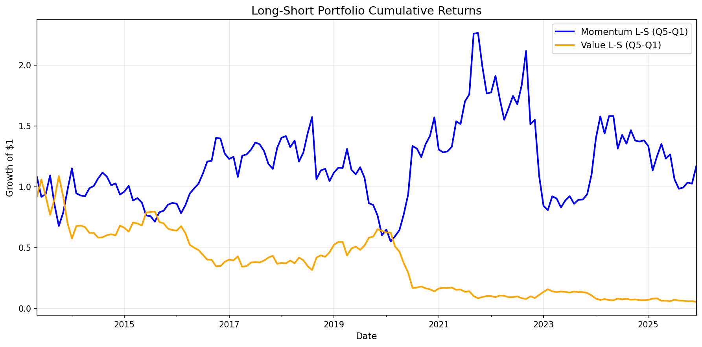
*Figure 6. Momentum L-S (blue) vs Contrarian L-S (orange). Contrarian collapses to near zero while momentum peaks at ~2.25×.*

**Year-by-Year:**
- Momentum best: 2020 (+160%), worst: 2019 (-42%)
- Positive in 8/13 years

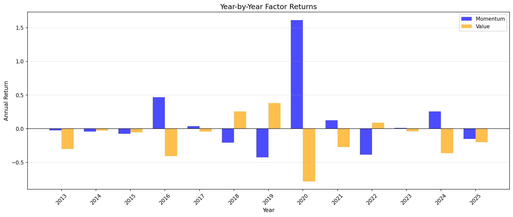
*Figure 7. Annual returns for Momentum vs Contrarian L-S strategies. Momentum's banner year was 2020 (+160%); contrarian shows persistent underperformance.*

**Key Insight:** Clear monotonic momentum relationship; contrarian fails in momentum-driven markets

---

### Risk Metrics & Portfolio Construction

**Sample Period:** 1999-2025 (full history)

**Individual Stock Metrics:**

| Stock | Ann. Return | Ann. Vol | Sharpe | Beta | Max DD |
|-------|-------------|----------|--------|------|--------|
| TSLA | 53.6% | 62.8% | 0.853 | 2.14 | -93.1% |
| NVDA | 48.7% | 51.2% | 0.950 | 1.89 | -88.4% |
| V | 20.0% | 22.1% | **0.914** | 0.64 | -49.3% |
| UNH | 16.5% | 24.3% | 0.677 | **0.48** | -54.2% |

**Best Risk-Adjusted:** V (Sharpe 0.91), NVDA (0.95)  
**Best Diversifier:** UNH (beta 0.48, correlations 0.05-0.17 with tech)

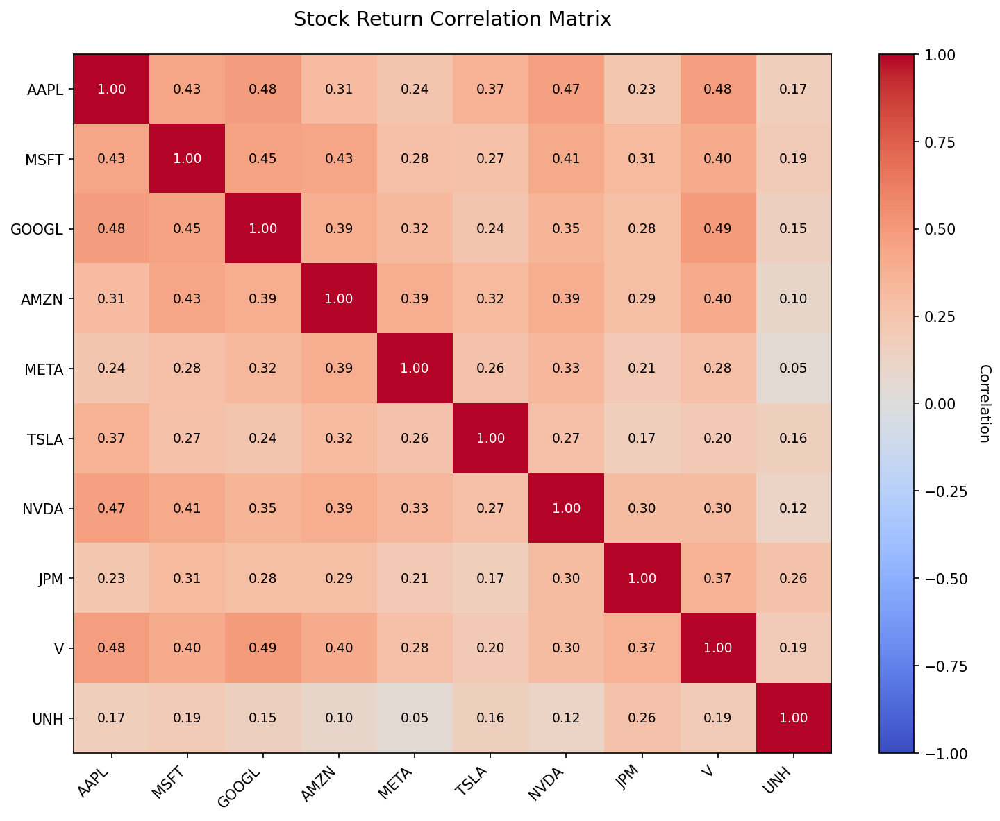
*Figure 8. Return correlation matrix. UNH stands out as the best diversifier (correlations 0.05–0.19 vs tech).*

**Diversification Benefit:**
- 1 stock portfolio: 41.5% vol
- 10-stock equal-weight: 27.4% vol
- **Risk reduction: 34%**

**Portfolio Construction Results:**

| Method | Ann. Return | Ann. Vol | Sharpe | Max DD |
|--------|-------------|----------|--------|--------|
| Equal-Weight | 24.4% | 27.4% | 0.890 | -59.2% |
| Risk Parity | 20.8% | 25.0% | 0.834 | -59.2% |
| Optimized (Max Sharpe) | 13.1% | 12.6% | **1.040** | **-40.9%** |

**Optimal Weights:** UNH 23.9%, V 21.0%, META 12.6%, GOOGL 13.2%, AAPL 0%, JPM 0%

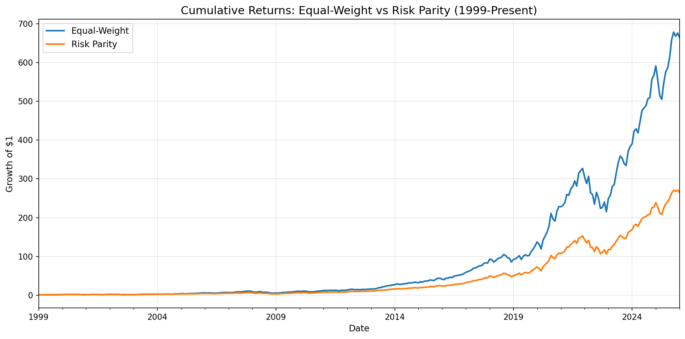
*Figure 9. Equal-weight vs Risk Parity cumulative returns (1999–present). Equal-weight leads in absolute return, driven by NVDA and TSLA exposure post-2019.*

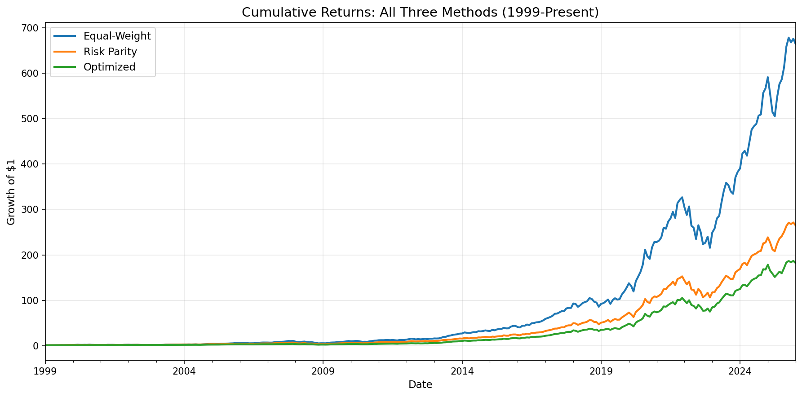
*Figure 10. All three portfolio construction methods. Optimized (green) delivers the smoothest path; equal-weight (blue) the highest absolute return.*

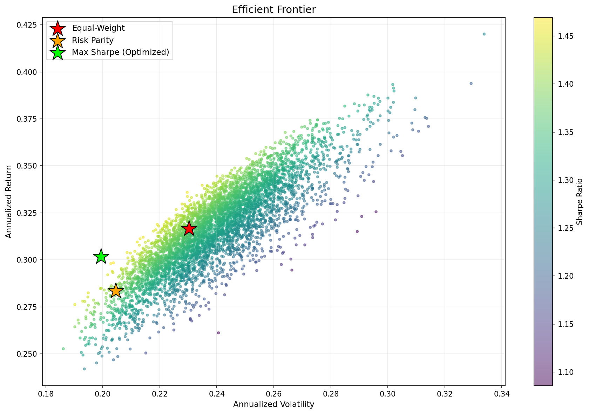
*Figure 11. Efficient frontier with 5,000 random portfolios. Stars mark equal-weight (red), risk parity (orange), and max Sharpe optimized (lime).*

**Key Insight:** Equal-weight beat optimization in absolute returns (+24% vs +13%) by maintaining exposure to volatile winners (NVDA, TSLA). Optimizer underweighted these and missed 2020-2025 tech boom. But optimized had best Sharpe (1.04) and shallowest drawdown (-41%).

---

### Event Study: Earnings Announcements

**Sample:** 45 earnings (AAPL, MSFT, GOOGL, AMZN, META; Q1 2023 - Q4 2025, 9 quarters each)

**Event Window:** [-5, +5] days  
**Estimation Window:** [-120, -6] days  
**Market Model:** Single-factor (equal-weight market proxy)

**Mixed Sample (All 45 Events):**
- CAAR[-5,+5]: +0.6% (not significant)
- No significant days
- **Problem:** Positive and negative earnings cancel out (cancellation bias)

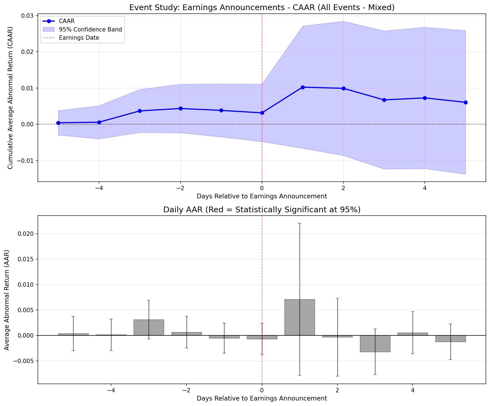
*Figure 12. CAAR for all 45 events combined — positive and negative earnings cancel, resulting in a flat +0.6% with no significant days.*

**Separated by Direction:**

**Positive Earnings (CAR > 0, n=24):**
- CAAR: +5.4%
- Day +1 AAR: +3.7% (t=4.15, p<0.001) ***
- 1 significant day

**Negative Earnings (CAR < 0, n=21):**
- CAAR: -4.8%
- Day +1 AAR: -2.7% (t=-3.53, p<0.001) ***
- Days +2, +3 also significant
- 3 significant days total

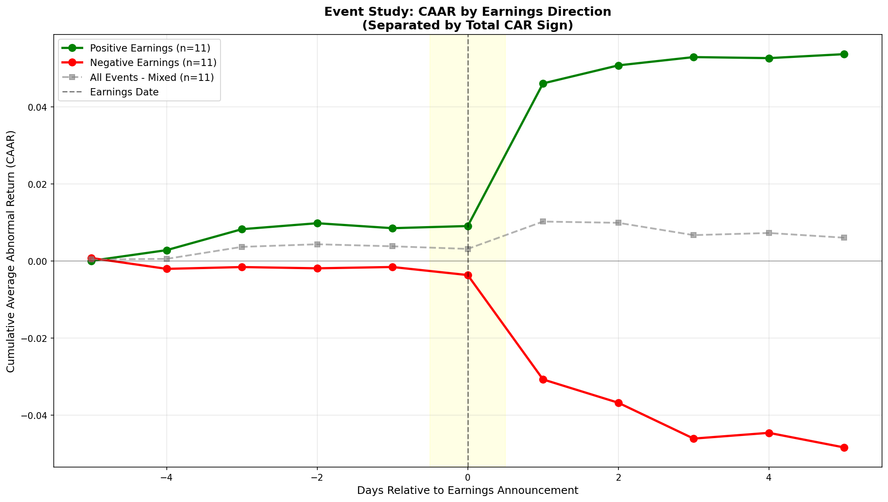
*Figure 13. CAAR separated by direction. Positive earnings (green) plateau at +5.4%; negative (red) drift to -4.8% with stronger persistence. Mixed sample (gray) hides both effects.*

**Key Findings:**
1. **Delayed reaction:** Most movement Day +1 (after-hours announcements)
2. **PEAD confirmed:** Drift continues 3-5 days post-announcement
3. **Asymmetric persistence:** Bad news lasts longer (3 days vs 1 day for good news)
4. **Magnitude:** Individual events range -13.4% to +12.6%

---

### Transaction Costs & Robustness

#### Turnover & Transaction Costs

**Turnover Analysis (Monthly):**
- Q1: 50.7%
- Q3: 113.2% (highest - middle quintile most unstable)
- Q5: 39.5%
- **Long-Short: 90.1%**

**Cost Impact on Long-Short:**

| Cost (bps) | Gross Return | Net Return | Cost Drag | Net Sharpe |
|------------|--------------|------------|-----------|------------|
| 0 | 9.2% | 9.2% | 0.0% | 0.232 |
| **10** | 9.2% | **8.1%** | **1.1%** | 0.204 |
| 25 | 9.2% | 6.5% | 2.7% | 0.163 |
| 50 | 9.2% | 3.8% | 5.4% | 0.095 |

**Key Finding:** At 10 bps (institutional rate), costs reduce returns by 12%. Strategy remains profitable even at 50 bps (+3.8% net).

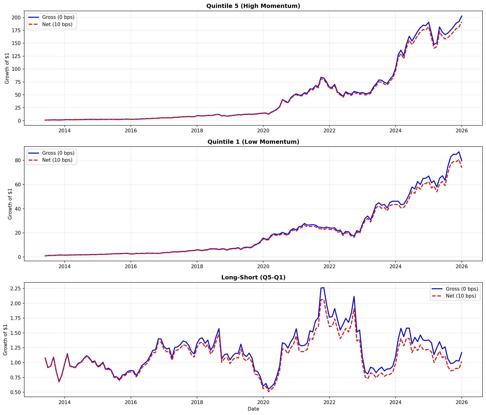
*Figure 14. Gross vs net (10 bps) cumulative returns for Q5, Q1, and L-S. The gap widens over time as cost drag compounds.*

#### Sub-Period Analysis

| Period | Ann. Return | Sharpe | Market Regime |
|--------|-------------|--------|---------------|
| **Pre-Crisis (1999-2007)** | **+26.0%** | **0.481** | Dot-com boom/bust |
| **Crisis (2008-2016)** | **-0.5%** | **-0.016** | Financial crisis, choppy |
| **Tech Boom (2017-2025)** | **+7.7%** | **0.186** | Low rates, tech rally |

**Key Finding:** Momentum is regime-dependent. Works in trending markets, fails during crises and choppy periods.

#### Sector Analysis

| Sector | N Stocks | Ann. Return | Sharpe |
|--------|----------|-------------|--------|
| **Tech** | 6 | **+23.2%** | **0.447** |
| Finance | 2 | -4.9% | -0.203 |

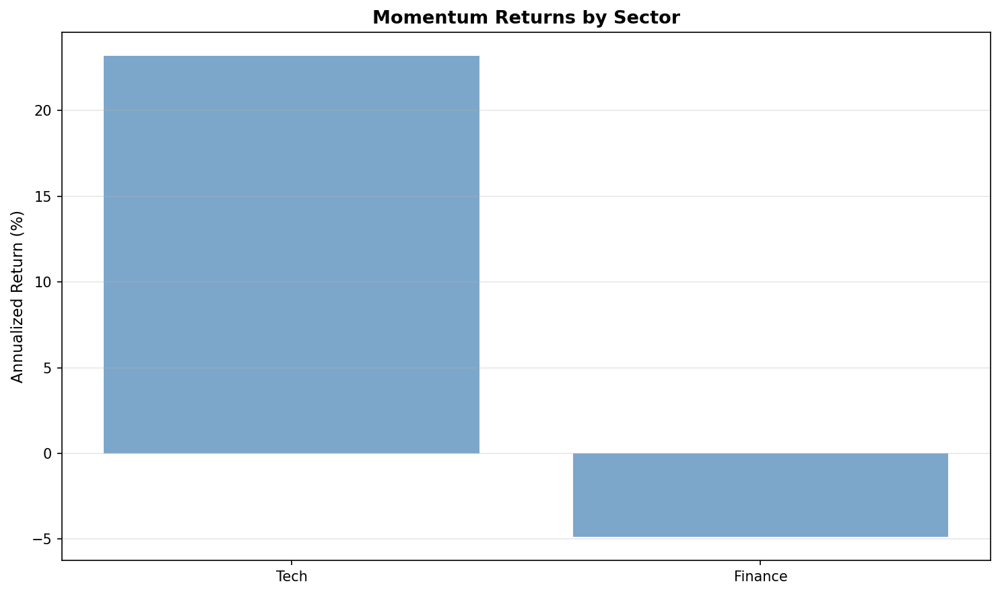
*Figure 15. Momentum L-S returns by sector. All alpha comes from tech; finance shows negative momentum.*

**Key Finding:** All returns driven by 6 tech stocks. Finance shows negative momentum. This is really tech momentum not broad momentum.

#### Parameter Sensitivity

**Sharpe Ratio Heatmap (Lookback × Rebalancing):**

|         | Monthly | Quarterly |
|---------|---------|-----------|
| **3-1** | 0.132   | 0.385     |
| **6-1** | 0.358   | 0.053     |
| **9-1** | 0.269   | -0.070    |
| **12-1** | **0.421** | -0.078  |

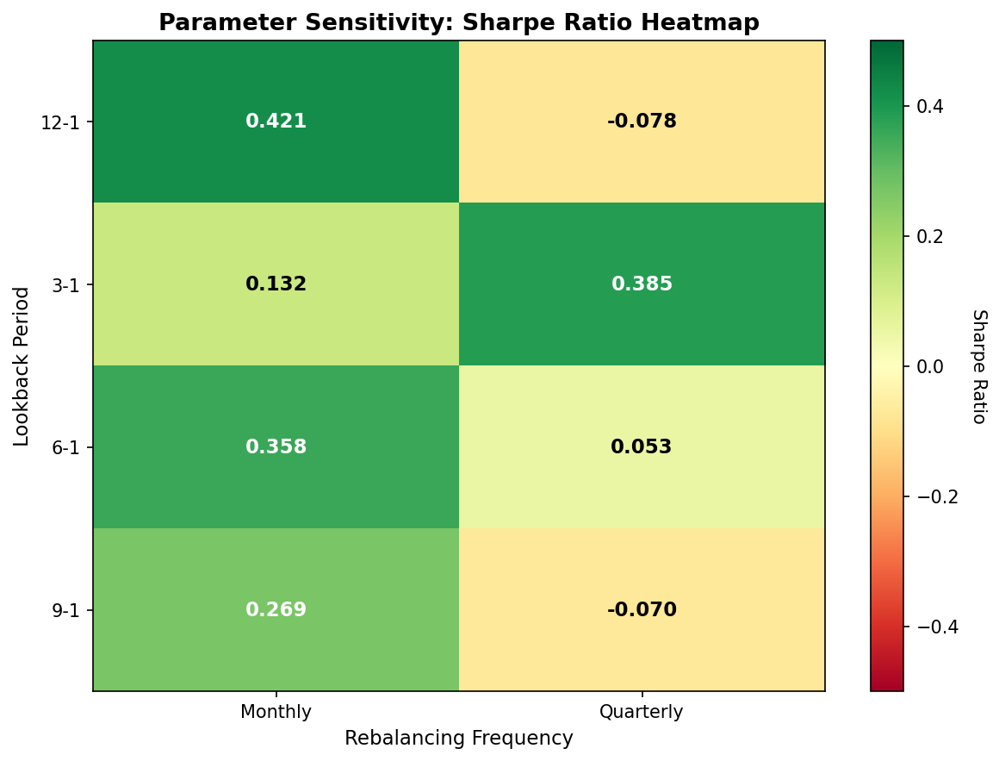
*Figure 16. Sharpe ratio heatmap across lookback × rebalancing frequency. 12-1 monthly dominates (0.421); quarterly rebalancing destroys value for longer lookbacks.*

**Key Findings:**
- **Best:** 12-1 monthly (Sharpe 0.42)
- **Worst:** 12-1 quarterly (Sharpe -0.08)
- Rebalancing frequency matters more than lookback period
- Quarterly fails because signals become stale over 3 months

---

## 3. Conclusions

### What Worked

- **Momentum factor:** +9.2% annual L-S returns (Sharpe 0.23), clear monotonic relationship
- **Event study separation:** Revealed +5.4%/-4.8% CAR when split by direction
- **Portfolio optimization:** Max Sharpe achieved best risk-adjusted returns (1.04) and shallowest drawdown (-41%)
- **12-1 monthly rebalancing:** Optimal parameters (Sharpe 0.42)

### What Didn't Work

- **Contrarian strategy:** -14.5% annual returns (price reversal proxy insufficient)
- **Quarterly rebalancing:** Negative Sharpe for 9-1 and 12-1 (signals too stale)
- **Finance sector momentum:** -5% annual returns (mean reversion dominant)
- **Mixed earnings sample:** Cancellation bias hid real effects

### Key Insights

**Transaction Costs:**
- 10 bps costs reduce returns by 12%
- High turnover (90% monthly) makes strategy expensive
- Viable for institutions, marginal for retail

**Regime Dependency:**
- Works in trends: +26% (1999-2007), +7.7% (2017-2025)
- Fails in crises: -0.5% (2008-2016)
- Need trend filter or regime-switching overlay

**Sector Concentration:**
- All returns from 6 tech stocks (+23%)
- Finance/Healthcare/Auto show no momentum
- This is "tech momentum" not broad momentum

**Market Microstructure:**
- Earnings effects appear Day +1 (after-hours timing)
- PEAD continues 3-5 days (market under-reaction)
- Negative news persists longer than positive

**Parameter Sensitivity:**
- Rebalancing frequency more important than lookback period
- Can't sacrifice monthly for cost savings
- 12-1 monthly optimal despite higher costs

---

## 4. Limitations

**Data:**
- Small universe (10 stocks)
- Survivorship bias (current large-caps only)
- Limited full coverage (May 2013 onwards)

**Methodology:**
- Forward returns assume perfect month-end timing
- Flat cost model doesn't capture market impact
- No shorting costs or rebate rates

**Assumptions:**
- Can trade at month-end close
- All 10 stocks have data each month
- Factor relationships stable over time

---

## 5. Future Work

- Expand to S&P 500 or Russell 1000
- True value factor (book-to-market, P/E from fundamentals)
- VIX-based regime filter
- Sector-neutral ranking
- Stop-losses and position limits
